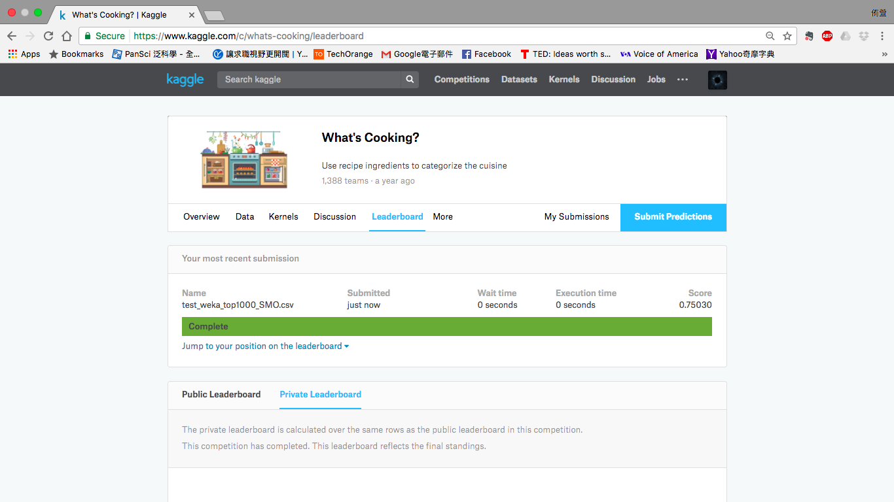

&nbsp; <p>
&nbsp; <p>
# <center> Final Project on Kaggle Competition </center>
# <center> What's Cooking </center>
&nbsp; <p>
&nbsp; <p>
&nbsp; <p>
<center>  </center>
&nbsp; <p>
&nbsp; <p>
&nbsp; <p>
&nbsp; <p>
&nbsp; <p>
### <center> Yu-Hsuan Guan (官侑萱)  </center>
### <center> NTHU Department of Mathematics</center>
### <center> yhguan8128@gmail.com </center>

<div style="page-break-after: always;"></div>

## 1. Introduction
### The main problem
The main issue of this competition is to classify lists of ingredients into correct kinds of cuisines. There are only two given files ``train.json`` and ``test.json``. Each training instance is represented in this format of JSON.  

```python
{
    "id": 10259,
    "cuisine": "greek",
    "ingredients": [ "romaine lettuce", "black olives", "grape tomatoes", "garlic",
    "pepper", "purple onion", "seasoning", "garbanzo beans", "feta cheese crumbles" ]
}
```
And, each testing instance is represented in the format of JSON.

```python
{
	"id": 18009,
	"ingredients": [ "baking powder", "eggs", "all-purpose flour", 
	"raisins", "milk", "white sugar" ]
}
``` 
  
There are totally 20 kinds of cuisines.

<center>
<table border="1" align="center">
<tr align="center"> <td>irish</td> <td>mexican</td> <td>chinese</td> <td>filipino</td> <td>vietnamese</td> </tr>
<tr align="center"> <td>moroccan</td> <td>brazilian</td> <td>japanese</td> <td>british</td> <td>greek</td> </tr>
<tr align="center"> <td>indian</td> <td>jamaican</td> <td>french</td> <td>spanish</td> <td>russian</td> </tr>
<tr align="center"> <td>cajun\_creole</td> <td>thai</td> <td>southern_us</td> <td>korean</td> <td>italian</td> </tr>
</table>
</center>

After an initial step of statistics, some basic summaries about data are given below.

<center>
<table border="1" align="center">
<tr align="center"> <td>**Number of training instances**</td> <td>39774</td> </tr>
<tr align="center"> <td>**Number of testing instances**</td> <td>9944</td> </tr>
<tr align="center"> <td>**Total number of ingregients in training data**</td> <td>6714</td> </tr>
</table>
</center>

<!--
| **Length of longest list of ingregients in training data** | **65** |
| **Length of shortest list of ingregients in training data** | **1** |
-->

The submission needs to be saved as a csv file of this form.

<center>
<table border="1" align="center">
<tr align="center"> <td>**id**</td> <td>**cuisine**</td> </tr>
<tr align="center"> <td>18009</td> <td>italian</td> </tr>
<tr align="center"> <td>35203</td> <td>chinese</td> </tr>
<tr align="center"> <td>$\vdots$</td> <td>$\vdots$</td> </tr>
</table>
</center>

Obviously, this competition is a **supervised problem** of **multi-class classification**. There are several kinds of applicable classifiers.

* Transform to binary - **OvR** (one-against-all), **OvO** (one-against-one)
* Extend from binary - **Naïve Bayes**, **KNN** (IBk), **Decision trees** (J48), **SVM** (SMO), **Neural networks** (Multilayer Perceptron)
### The main steps of learning
There are five major steps of machine learning in this project.

* **Data analysis** - We started with **data preprocessing** by these initial process.
	* Delete these special characters: ç, è, é, ®, and ™.
	* Convert all the strings into the type of UTF-8. 

* **Visualization** - If we transform the training data into a sparse matrix full of $0$ and $1$ directly, the matrix will have the size of $39774 \times 6714$. To cope with this matrix more efficiently, we need **dimension reduction** to compress the size of matrix without losing too many varieties of data. **This step is the main difference between related work and our new method** which will be mentioned in the sections 2 \& 3.

* **Modeling** - We chose **Weka** environment to create models. The detailed process of converting data matrix to the arff file for Weka environment will be mentioned also in the sections 2 \& 3. All the codes used in this project can be found in the GitHub.
	* [https://github.com/alicia6174/Kaggle-Whats-Cooking](https://github.com/alicia6174/Kaggle-Whats-Cooking)

	We skipped **tuning** in this project because we focused on comparing the results of two methods under different models.

<!--
**AutoWeka** is a tool which provides the ideal model for any given data, but we didn't use it in this project since it cost too much time. 
Can we use AutoWeka to do tuning? 
-->

* **Evaluation** - We presented various quantitiest to evaluate different models in the section 4.  Finally, we gave the scores of our submissions on Kaggle site.

<!--
These evidences showed that our method works better than the old one.
-->

* **Prediction** - We saved the best model depending on the evaluation and used it to predict the cuisine of each testing data. The process will be mentioned also in the sections 2 \& 3.

## 2. Related work
### Descriptions of method

* **Dimension reduction** - The old method collected the **top ingredients** which occur most frequently in the training data as the features. To compare with our method, we chose the number of features to be $1000$. In that way, each data could be transformed into a $1000$-dimensional vector with the $i$th component being $1$ if its ingredients contain the $i$th feature and being $0$ if otherwise. The training data matrix of size $39774 \times 1000$ (without the header and labels) had this form and was saved as a csv file.

<center>
<table border="1" align="center">
<tr align="center"> <td>**1**</td> <td>**2**</td> <td>$\ldots\ldots$</td> <td>**1000**</td> <td>**cuisine**</td> </tr>
<tr align="center"> <td>0</td> <td>0</td> <td>$\ldots\ldots$</td> <td>0</td> <td>greek</td> </tr>
<tr align="center"> <td>1</td> <td>0</td> <td>$\ldots\ldots$</td> <td>0</td> <td>southern_us</td> </tr>
<tr align="center"> <td>$\vdots$</td> <td>$\vdots$</td> <td>$\ldots\ldots$</td> <td>$\vdots$</td> <td>$\vdots$</td> </tr>
<tr align="center"> <td>0</td> <td>1</td> <td>$\ldots\ldots$</td> <td>1</td> <td>mexican</td> </tr>
</table>
</center>
 
* **Modeling** - We converted the csv file into an arff file so that the Weka environment would work more smoothly. We tried several multi-class classifiers for comparison. According to the evaluation (see §4), we saved the best model   **SMO** to make predictions.

* **Prediction** - We repeated the steps of preprocessing and file conversion to create the needed file of testing data. The reduced testing data matrix of size $9944 \times 1000$ (without the header and labels) had the following form and was saved as a csv file. After converting it to an arff file, we used Weka again to predict the result. Finally, we saved the result as a needed submission file and uploaded it on the Kaggle site for scoring. 

<center>
<table border="1" align="center">
<tr align="center"> <td>**1**</td> <td>**2**</td> <td>$\ldots\ldots$</td> <td>**1000**</td> <td>**cuisine**</td> </tr>
<tr align="center"> <td>0</td> <td>0</td> <td>$\ldots\ldots$</td> <td>0</td> <td>?</td> </tr>
<tr align="center"> <td>0</td> <td>0</td> <td>$\ldots\ldots$</td> <td>0</td> <td>?</td> </tr>
<tr align="center"> <td>$\vdots$</td> <td>$\vdots$</td> <td>$\ldots\ldots$</td> <td>$\vdots$</td> <td>$\vdots$</td> </tr>
<tr align="center"> <td>0</td> <td>0</td> <td>$\ldots\ldots$</td> <td>0</td> <td>?</td> </tr>
</table>
</center>

### Detailed steps
<center>
<table border="1" align="center">
<tr align="left"> <td>**Codes \& ML Tool**</td> <td>**Created files**</td> <td>**Goals**</td> </tr>
<tr align="left"> <td>prefix\_filter</td> <td>train.json</td> <td>delete special characters</td> </tr>
<tr align="left"> <td>create\_top\_ing.py</td> <td>ing\_top1000.csv</td> <td>find top 1000 ingredietns</td> </tr>
<tr align="left"> <td>create_weka.py</td> <td>train\_weka\_top1000.csv **(79.9M)**</td> <td>create the reduced training data for modeling</td> </tr>
<tr align="left"> <td>weka-csv-arff.pl</td> <td>train\_weka\_top1000.arff</td> <td>convert to arff file</td> </tr>
<tr align="left"> <td>Weka</td> <td></td> <td>create models and make evaluations</td> </tr>
<tr align="left"> <td>Weka</td> <td>train\_weka\_top1000\_SMO.model</td> <td>create the model of SMO</td> </tr>
<tr align="left"> <td>prefix\_filter</td> <td>test.json</td> <td>delete special characters</td> </tr>
<tr align="left"> <td>create\_weka.py</td> <td>test\_weka\_top1000.csv **(19.9M)**</td> <td>create the reduced testing data for prediction</td> </tr>
<tr align="left"> <td>weka-csv-arff.pl</td> <td>test\_weka\_top1000.arff</td> <td>convert to arff file</td> </tr>
<tr align="left"> <td>Weka</td> <td>test\_weka\_top1000\_SMO.txt</td> <td>make predictions</td> </tr>
<tr align="left"> <td>weka-to-kaggle.pl</td> <td>test\_weka\_top1000\_SMO.csv</td> <td>create the submission file for Kaggle</td> </tr>
</table>
</center>

The 1001th attribute in the file test\_weka\_top1000.arff needs to be modified to the $20$ cuisines before testing. The submission file can be found in the GitHub.

* [https://github.com/alicia6174/Kaggle-Whats-Cooking/tree/master/submission\_files](https://github.com/alicia6174/Kaggle-Whats-Cooking/tree/master/submission_files)

## 3. New methods
### Descriptions of method

* **Dimension reduction** - Our method adopted **PCA** which is a linear unsupervised reduction. First we collected the totally $6714$ ingredients as features and each data could be transformed into a $6714$-dimensional vector with the $i$th component being $1$ if its ingredients contain the $i$th feature and being $0$ if otherwise. In that way, we could create the training data matrix of size $39774 \times 6714$. Second we computed the eigenvalues and eigenvectors of the corresponding covariance matrix. Third we chose the number of reduced dimension to be $1000$ according to the score defined by
$$\textrm{Score}(k) = \frac{\sum_{i=1}^k \lambda_i}{\sum_{i=1}^{6714} \lambda_i}$$
where $\lambda_i$s are the eigenvalues which satisfy $\lambda_1 \geq \lambda_2 \geq \ldots \geq \lambda_{6714}$. This grapf of score versus number of eigenvalues shows that $1000$ corresponds to the score of $90$.
<center>  </center>
Finally we multiplied the training data matrix by this matrix composed of the top $1000$ eigenvectors to obtain the reduced training data matrix. Each feature had been normalized and rounded to the second decimal.
$$
\begin{bmatrix}
\quad & \quad & \quad & \quad \\
\quad & \quad & \quad & \quad \\
v_1 & v_2 & \ldots & v_{1000}\\
\quad & \quad & \quad & \quad \\
\quad & \quad & \quad & \quad 
\end{bmatrix}_{\; 6714 \times 1000}
$$
The reduced training data matrix of size $39774 \times 1000$ (without the header and labels) had this form and was saved as a csv file.

<center>
<table border="1" align="center">
<tr align="center"> <td>**1**</td> <td>**2**</td> <td>$\ldots\ldots$</td> <td>**1000**</td> <td>**cuisine**</td> </tr>
<tr align="center"> <td>0.71</td> <td>0.34</td> <td>$\ldots\ldots$</td> <td>0.45</td> <td>greek</td> </tr>
<tr align="center"> <td>0.49</td> <td>0.57</td> <td>$\ldots\ldots$</td> <td>0.47</td> <td>southern_us</td> </tr>
<tr align="center"> <td>$\vdots$</td> <td>$\vdots$</td> <td>$\ldots\ldots$</td> <td>$\vdots$</td> <td>$\vdots$</td> </tr>
<tr align="center"> <td>0.30</td> <td>0.30</td> <td>$\ldots\ldots$</td> <td>0.47</td> <td>mexican</td> </tr>
</table>
</center>

* **Modeling** - This step was conducted almost in the same way as in the section 2. The main difference was that **SMO** still served as the best model after evaluation (see §4).

* **Prediction** - We conducted the same step of dimension reduction to obtain the reduced testing data matrix. The reduced testing data matrix of size $9944 \times 1000$ (without the header and labels) had this form and was saved as a csv file. The following steps was conducted in the same way as in the section 2.

<center>
<table border="1" align="center">
<tr align="center"> <td>**1**</td> <td>**2**</td> <td>$\ldots\ldots$</td> <td>**1000**</td> <td>**cuisine**</td> </tr>
<tr align="center"> <td>0.83</td> <td>0.67</td> <td>$\ldots\ldots$</td> <td>0.52</td> <td>?</td> </tr>
<tr align="center"> <td>0.93</td> <td>0.63</td> <td>$\ldots\ldots$</td> <td>0.53</td> <td>?</td> </tr>
<tr align="center"> <td>$\vdots$</td> <td>$\vdots$</td> <td>$\ldots\ldots$</td> <td>$\vdots$</td> <td>$\vdots$</td> </tr>
<tr align="center"> <td>0.70</td> <td>0.20</td> <td>$\ldots\ldots$</td> <td>0.47</td> <td>?</td> </tr>
</table>
</center>

### Detailed steps
<center>
<table border="1" align="center">
<tr align="left"> <td>**Codes \& ML Tool**</td> <td>**Created files**</td> <td>**Goals**</td> </tr>
<tr align="left"> <td>prefix\_filter</td> <td>train.json</td> <td>delete special characters</td> </tr>
<tr align="left"> <td>create\_top\_ing.py</td> <td>ing.csv</td> <td>find all the 6714 ingredients</td> </tr>
<tr align="left"> <td>create\_mtx.py</td> <td>train\_mtx.csv</td> <td>create the training data matrix of size 39774 x 6714</td> </tr>
<tr align="left"> <td>do\_pca.cpp</td> <td>eigVal\_eiglVec</td> <td>find the PCs and eigenvalues of the above matrix</td> </tr>
<tr align="left"> <td>create\_eigVec.pl</td> <td>eigVec</td> <td>divide the file eigVal\_eiglVec into eigVec and eigVal</td> </tr>
<tr align="left"> <td>create\_eigVal.pl</td> <td>eigVal</td> <td>divide the file eigVal\_eiglVec into eigVec and eigVal</td> </tr>
<tr align="left"> <td>create\_pca_mtx.m</td> <td>train\_pca\_mtx\_1000.csv</td> <td>create the reduced training data matrix of size 39774 x 1000 by matrix mutiplication</td> </tr>
<tr align="left"> <td>create\_weka.py</td> <td>train\_weka\_pca1000.csv **(187M)**</td> <td>create the reduced training data for modeling </td> </tr>
<tr align="left"> <td>weka-csv-arff.pl</td> <td>train\_weka\_pca1000.arff</td> <td>convert to arff file</td> </tr>
<tr align="left"> <td>Weka</td> <td></td> <td>create models and make evaluations</td> </tr>
<tr align="left"> <td>Weka</td> <td>train\_weka\_pca1000\_SMO.model</td> <td>create the model of SMO</td> </tr>
<tr align="left"> <td>prefix\_filter</td> <td>test.json</td> <td>delete special characters</td> </tr>
<tr align="left"> <td>create\_mtx.py</td> <td>test\_mtx.csv</td> <td>create the testing data matrix of size 9944 x 6714</td> </tr>
<tr align="left"> <td>create\_pca\_mtx.m</td> <td>test\_pca\_mtx\_1000.csv</td> <td>create the reduced testing data matrix of size 9944 x 1000 by matrix mutiplication</td> </tr>
<tr align="left"> <td>create\_weka.py</td> <td>test\_weka\_pca1000.csv **(48.7M)**</td> <td>create the reduced testing data for prediction</td> </tr>
<tr align="left"> <td>weka-csv-arff.pl</td> <td>test\_weka\_pca1000.arff</td> <td>convert to arff file</td> </tr>
<tr align="left"> <td>Weka</td> <td>test\_weka\_pca1000\_SMO.txt</td> <td>make predictions</td> </tr>
<tr align="left"> <td>weka-to-kaggle.pl</td> <td>test\_weka\_pca1000\_SMO.csv</td> <td>create the submission file for Kaggle</td> </tr>
</table>
</center>

The 1001th attribute in the file test\_weka\_pca1000.arff needed to be modified to the 20 cuisines before testing. The submission file can be found in the GitHub.

* [https://github.com/alicia6174/Kaggle-Whats-Cooking/tree/master/submission\_files](https://github.com/alicia6174/Kaggle-Whats-Cooking/tree/master/submission_files)

## 4. Comparison results
### Evaluation
Our devices were the **Virtual Machine Instances** on **Google Cloud Platform**. We applied for 2 virtual machines of this size.

* OS: ubuntu16-04
* HDD: 20G
* CPU: 1 vCP
* RAM: 6.5 GB

We used the ML tool **Weka Environment** with the version shown below. In this project, we needed to modify the heap size to 4G. (The default size was 512M.)
	
* Weka Environment for Knowledge Analysis Version 3.8.0
* Java version "1.8.0_121"
* Java(TM) SE Runtime Environment (build 1.8.0_121-b13)
* Java HotSpot(TM) 64-Bit Server VM (build 25.121-b13, mixed mode)

We split the training data into **66.0% for training and the remainder for testing**. We didn't compute the k-fold cross-validation since the training data was too large. The correctness and the running time are shown in the table below. The running includes the time taken to build model and the time to test model on test split.

<center>
<table border="1" align="center">
<tr align="center"> 
<td colspan="3" valign="center">
**66% Percentage Split Correctness, $\%$** <p> 
**Running Time, $sec.$** 
</td> 
</tr>
<tr align="center"> 
<td>**Models**</td> 
<td>**Top-ing Method**</td> 
<td>**PCA Method**</td> 
</tr>
<tr align="center"> 
<td>IBk (k=199) </td> 
<td>27.0206 <p> 1778.31</td> 
<td>36.3085 <p> 2422.41</td> 
</tr>
<tr align="center"> 
<td>Naïve Bayes</td> 
<td>62.6414 <p> 86.26</td> 
<td>37.2846 <p> 55.37</td> 
</tr>
<tr align="center"> 
<td>J48</td> 
<td>63.5732 <p> 1353.21</td> 
<td>40.0281 <p> 598.85</td> 
</tr>
<tr align="center"> 
<td>SMO</td> 
<td>72.4543 <p> 2871.48</td> 
<td>73.2382 <p> 2401.43</td> 
</tr>
</table>
</center>

<!--
<tr align="center"> 
<td>One-against-all</td> 
<td>Have run 27.5hr <p> Give up</td> 
<td>66.2797 <p> 12065.99</td> 
</tr>
<tr align="center"> 
<td>One-against-one</td> 
<td>Have run 27hr <p> Give up</td> 
<td>Out of memory</td> 
</tr>
<tr align="center"> 
<td>Multilayer Perceptron</td> 
<td>Have run 27hr <p> Give up</td> 
<td>Have run 30hr <p> Give up</td> 
</tr>
-->

We also focused on the quantities - Kappa statistic, MAE, AUC, and confusion matrix.
	
* **Kappa statistic** $K$ shows the difference between the classifier and stochastic classification, which is a decimal in $[0,1]$. $K=0$ means no difference while $K=1$ represents the classifier is totally different from the stochastic classification. Generally speaking, $K$ is proportional to AUC and correctness. Therefore, the closer $K$ approaches $1$ ($K \approx 1$), the better the result of the classifier is. 
* **Mean absolute error** is the average of absoluate error.
$$ \textrm{MAE} = \frac{\sum_{i=1}^{9944}|e_i|}{9944} $$ 
* **ROC Area** is the area under the ROC curve which is a decimal in $[0,1]$. The closer AUC approaches $1$ ($\textrm{AUC} \approx 1$), the better the result of the classifier is. For multi-class classification problem, we need to evaluate AUC for each class respectively. 
* **Confusion Matrix** is the matrix defined by
$$
(i,j)\textrm{-entry = number of counts for actual class is $i$th class and predicted class is $j$th class.}
$$
Therefore, the more dominated the diagonal is, the better the result of the classifier is.
	
The Kappa statistic and MAE are shown in the following table. The results of AUC  and confusion matrix can be found in the appendix.

<center>
<table border="1" align="center">
<tr align="center"> 
<td colspan="3" valign="center">
**Kappa statistic** <p> 
**Mean absolute error** 
</td> 
</tr>
<tr align="center"> 
<td>**Models**</td> 
<td>**Top-ing Method**</td> 
<td>**PCA Method**</td> 
</tr>
<tr align="center"> 
<td>IBk (k=199) </td> 
<td>0.1039 <p> 0.0804</td> 
<td>0.1480 <p> 0.0884</td> 
</tr>
<tr align="center"> 
<td>Naïve Bayes</td> 
<td>0.5861 <p> 0.0408</td> 
<td>0.3340 <p> 0.0628</td> 
</tr>
<tr align="center"> 
<td>J48</td> 
<td>0.5916 <p> 0.0440</td> 
<td>0.3351 <p> 0.0607</td> 
</tr>
<tr align="center"> 
<td>SMO</td> 
<td>0.6914 <p> 0.0905</td> 
<td>0.7012 <p> 0.0905</td> 
</tr>
</table>
</center>

All the training results from Weka can be found in the GitHub.

* [https://github.com/alicia6174/Kaggle-Whats-Cooking/tree/master/train\_weka\_results](https://github.com/alicia6174/Kaggle-Whats-Cooking/tree/master/train_weka_results)

### Kaggle score
The detailed process of testing are described in the sections 2 \& 3. The followings are the final results. The process of testing costed just several seconds, so we didn't put the running time here.

* Top-ing Method **0.73994** 
<center>  </center>
* PCA Method **0.66020**
<center>  </center>

## 5. Discussion and conclusion
We explain the reasons of some choices at first.

* We chose the number of features to be 1000 which has been explained in the section 3. On the other hand, we've tried 200 features for Top-ing method, but the result was not good. We've also tried 2000 features for PCA method, but our machines ran out of memory.
* We chose the models IBk, Naïve Bayes, J48, and SMO since they works for multi-class classification problem as we mentioned in the introduction. We've ever tried OvR, OvO, and Multilayer Perceptron. We didn't wait for the results because they all costed over one day.
* All the parameters in the models remained as the default except the number of nearest neighbors $k$ in IBk. We chose $k=199$ since the ideal value of $k$ is the root square of the number of training instances.
$$\sqrt{39774} \approx 199.43$$

Now we discuss about the results of our experiments.

* The file size of the training data of PCA method (187M) is almost twice larger than the one of Top-ing method (79.9M). This result is due to the reason we rounded the data values of PCA method to the second decimal. This observation also holds for testing data (48.7M vs. 19.9M).
* The Top-ing method worked better than the PCA method. Why??? (Try to explain this in the aspect of the quantities in §4)

Finally, we end this project with some expectations and future work. 

* We actually made a KNN algorithm ourselves with the distance defined by
$$d(x_i,x_j) =\; \textrm{number of different ingredients of $x_i$ and $x_j$}$$
where $x_i$ means the $i$th training data. We dealt with the raw data directly and chose $k=21$ (chosen by tuning). This simple method created the better result than the one of PCA method.  
	* My KNN **0.67659**
<center>  </center>
You can find the code ``My_KNN.py`` also in the GitHub site.
	* [https://github.com/alicia6174/Kaggle-Whats-Cooking](https://github.com/alicia6174/Kaggle-Whats-Cooking)

* This competition can be categorized as a **text mining** problem. The future work  would concentrate on **Compressed Sensing**, **Hidden Markov Model**, and **Latent Dirichlet Allocation**.

<!--
## Appendix
### How to use Weka
Sketch the steps.

* Transform training data to a csv file. 
* Try several multi-class classifications and choose features (ex. #(ing.) for each cuisine). (Show the graph of feature distribution)
* Compute the accuracy and cross validation.
* Choose a model to test. ex. J48, KNN, PLA, Bayes...

Formal steps.

* Create a new csv data file (in a needed form).
* Convert it to UTF8 encoding. (use instruction in vim [A]).
* Convert it into train and test arff files (Hsin’s shell-script [A]).
* Train train.arff  by xxx on Weka, analyze the data (MAE, ROC…), and save xxx.model.
* Test test.arff by the model, and save result_xxx.txt.
* Convert result_xxx.txt to result_xxx.csv.


### How to use Automatic Weka
Version of AutoWeka.
Sketch the steps.
### Detailed Accuracy By Class
We only put the results of SMO here since SMO served as the bset model.

### Confusion Matrix
We only put the results of SMO here since SMO served as the bset model.
-->

## References
<!--
1. P. Hall *et al.* Choice of neighbor order in nearest-neighbor classification. *Ann. Stat.*, 36(5):2135-2152, 2008.
[1]: https://arxiv.org/pdf/0810.5276.pdf 
-->
<!--
2. Y.-J. Lee, Y.-R. Yeh, and H.-K. Pao. Introduction to Support Vector Machines and Their Applications in Bankruptcy Prognosis. *Handbook of Computational Finance*, 731-761, 2012.
[2]: https://link.springer.com/chapter/10.1007%2F978-3-642-17254-0_27
-->
3. 袁梅宇. *王者歸來：WEKA機器學習與大數據聖經 3/e.* 佳魁資訊, 台北市, 2016.
[3]: https://www.tenlong.com.tw/products/9789863794578 

<!-- §1. Recheck. 把五大步驟裡的文章結構拿到外面寫. 加寫兩個方法的動機: Top ing. \& PCA (後面方法均改名為這樣不要叫新舊方法). -->
<!-- §2,3. create\_eigVec.pl與create\_eigVal.pl檢查是否正確！-->
<!-- §5. 加上len分數更高. My KNN 加上計算距離的code，註明是用原始資料算. 繼續多加特徵誒有意義，需要找更有效的方法(future work). -->
<!-- §Ref. PCA Score, KNN's K -->
<!-- 新的section新起一頁？ -->
<!-- 圖片(test_weka_top1000_SMO), 目錄, 頁碼, 與插圖？ -->
